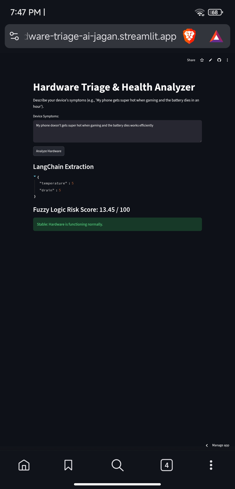
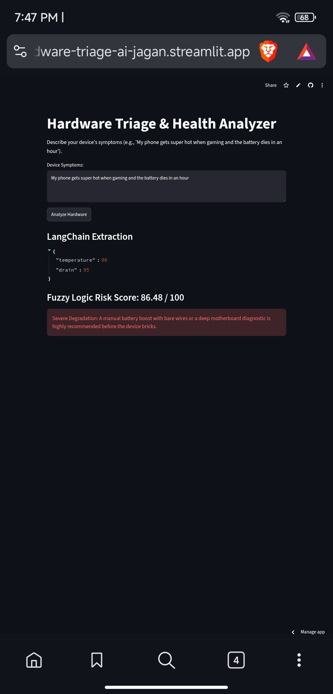

# 📱 Device Hardware Triage & Health Analyzer

**Student Name:** [Your Name]  
**Roll Number:** [Your Roll No]  
**Class / Division:** TY IT  
**Subject:** IKS Individual Project  
**Live Deployment Link:** [https://hardware-triage-ai-jagan.streamlit.app](https://hardware-triage-ai-jagan.streamlit.app)  
**GitHub Repository:** [https://github.com/tech-man2007/hardware-triage-ai](https://github.com/tech-man2007/hardware-triage-ai)

---

## 📌 Project Overview
The **Device Hardware Triage & Health Analyzer** is an AI-driven diagnostic system designed to assess hardware degradation risk using unstructured user-reported symptoms. By combining Natural Language Processing (LangChain + Google Gemini 2.5 Flash) with Fuzzy Logic (SciKit-Fuzzy), the system extracts qualitative physical parameters (thermal rise, battery drain rate) and maps them into precise risk scores (0–100) with actionable repair triage recommendations.

---

## 🏛️ IKS (Indian Knowledge Systems) Connection
This project draws conceptual alignment from traditional Indian Knowledge Systems—specifically the holistic diagnostic principles of ***Nadi Pariksha*** (Pulse Diagnosis in Ayurveda). Rather than relying on isolated binary thresholds (working/broken), traditional diagnostic systems evaluate continuous, overlapping qualitative symptoms across interconnected body systems to assess systemic risk. Similarly, this system translates qualitative, multi-variable human symptom descriptions into soft-computing fuzzy sets (*Normal, Warm, Critical / Slow, Moderate, Fast*) to evaluate holistic hardware health.

---

## ✨ Main Features
- **Unstructured Symptom Parsing:** Uses LangChain and Google Gemini 2.5 Flash to extract numerical severity metrics from freeform text descriptions.
- **Fuzzy Logic Decision Engine:** Evaluates continuous risk boundaries without rigid `if/else` threshold errors.
- **Automated Triage Recommendations:** Provides actionable repair guidance based on calculated risk scores (e.g., thermal pad replacement, manual battery boosting, or motherboard diagnostics).
- **Secure Key Management:** Implements Streamlit Cloud Secrets to prevent exposure of API credentials.

---

## 🛠️ Tech Stack
- **Language:** Python 3.10+
- **Frontend & Hosting:** Streamlit Community Cloud
- **LLM Orchestration:** LangChain (`langchain-google-genai`)
- **Generative AI Model:** Google Gemini 2.5 Flash (`gemini-2.5-flash`)
- **Fuzzy Logic Framework:** `scikit-fuzzy`, `numpy`, `scipy`
- **Graph Dependencies:** `networkx`

---

## 🔐 Environment Variables / Secrets
The application requires a Google Gemini API key passed securely via environment configuration or Streamlit Secrets:

```toml
# .streamlit/secrets.toml (Streamlit Cloud Secrets)
GOOGLE_API_KEY = "GEMINI_API_KEY"
```

---

## 🚀 Installation & Local Setup

1. **Clone the Repository:**
   ```bash
   git clone https://github.com/tech-man2007/hardware-triage-ai.git
   cd hardware-triage-ai
   ```

2. **Install Dependencies:**
   ```bash
   pip install -r requirements.txt
   ```

3. **Configure Local Secret:**
   Create a `.streamlit/secrets.toml` file in the root directory and add your API key:
   ```toml
   GOOGLE_API_KEY = "api-key-here"
   ```

4. **Run the Application:**
   ```bash
   streamlit run app.py
   ```

---

## 💡 How to Use
1. Open the live deployment link in any web browser.
2. Enter qualitative hardware symptoms into the input box (e.g., *"Phone gets super hot when playing games and dies in an hour"*).
3. Click **Analyze Hardware**.
4. View the extracted JSON parameter metrics from LangChain and the calculated Fuzzy Logic Risk Score with triage recommendations.

---

## 🖼️ Application Screenshots

### 1. Normal Hardware State (Low Risk)

- **Input:** *"My phone doesn't gets super hot when gaming and the battery dies works efficiently"*[span_0](start_span)[span_0](end_span)
- **LangChain Parameters:** `temperature: 5`, `drain: 5`[span_1](start_span)[span_1](end_span)
- **Fuzzy Logic Risk Score:** `13.45 / 100` (Stable)[span_2](start_span)[span_2](end_span)

### 2. Severe Hardware Degradation (High Risk)

- **Input:** *"My phone gets super hot when gaming and the battery dies in an hour"*[span_3](start_span)[span_3](end_span)
- **LangChain Parameters:** `temperature: 90`, `drain: 95`[span_4](start_span)[span_4](end_span)
- **Fuzzy Logic Risk Score:** `86.48 / 100` (Severe Risk)[span_5](start_span)[span_5](end_span)
